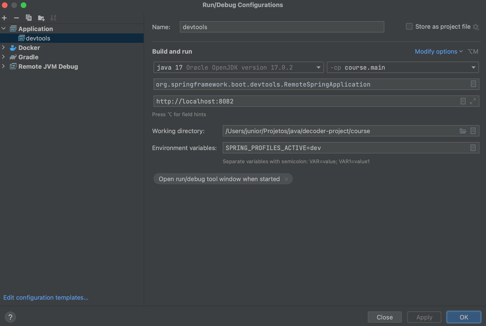
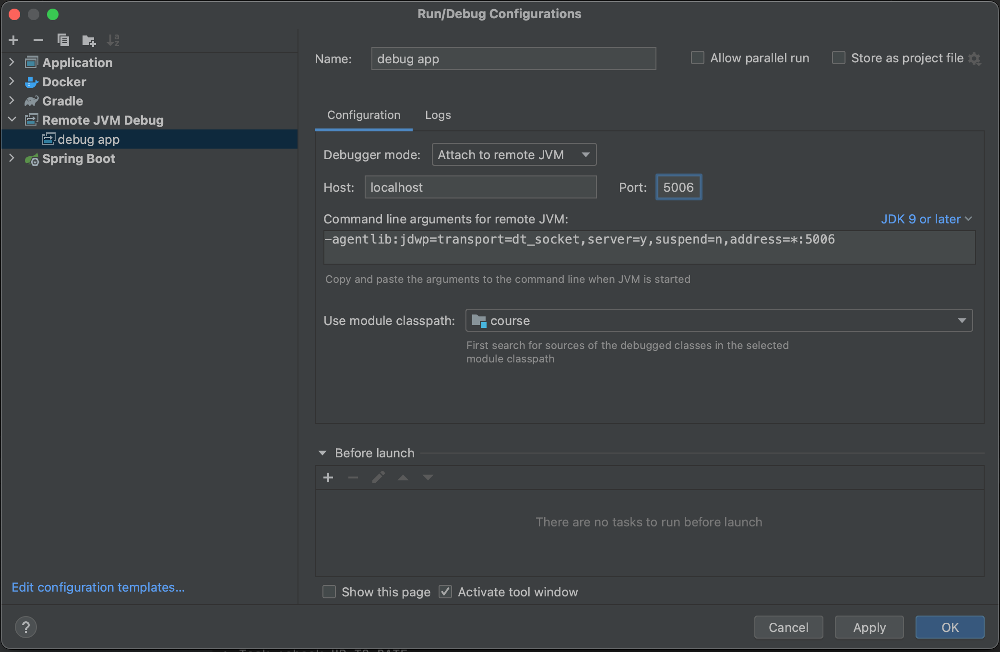

# Microservice de cursos desenvolvido no curso Decoder Project


## Getting Started

## Pré-requisitos

- Docker
- Docker-compose

## Subir a aplicação

rode o seguinte comando no terminal:

```
docker-compose up
```

a aplicação está configurada para escutar a porta 8082

## Configurar Spring Devtools para hot reload

A aplicação já esta configurada para aguardar uma conexão remota com o devtools no profile de dev, após inicia-la seguindo os passos [Subir a aplicação](#subir-a-aplicação) siga as seguintes instruções:

* Inicie o spring devtools em sua máquina real, no Intellij, por exemplo é possível criar uma configuração de run da seguinte forma:



* Agora com o devtools conectado remotamente com o container para que a aplicação reinicie aplicando as alterações realizadas gere o jar novamente usando a task **_gradle build_**;

* Deve-se usar a task do gradle porque o DevTools está configurado para aplicar novas alterações somente se o arquivo trigger.txt (localizado em src/main/resources/trigger.txt) for alterado e a task build arquivo build.gradle está configurada para alterar o conteúdo do mesmo


## Usar Debug na aplicação

A aplicação já está devidamente configurada para receber realizar remote debug por conta da seguinte linha incluida na task **_bootRun_**:

```
jvmArgs '-Xrunjdwp:transport=dt_socket,server=y,suspend=n,address=*:5005'
```

* depois de subir a aplicação seguindo as instruções do tópico [Subir a aplicação](#subir-a-aplicação) é necessário criar uma configuração de remote debug para se conectar com o container, segu abaixo um exeplo de configuração




* Agora os breakpoints serão acionados e escutados pela IDE